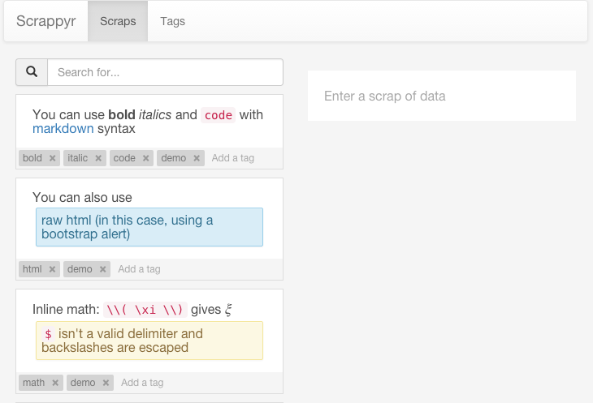

Scrappyr
========

A simple app for managing scraps of data.

This is primarily a learning project for me, so there are probably many
issues that make this app unusable, even for me. Nevertheless, there are a few
interesting ideas here.

One of my primary motivations was to have markdown-generated snippets for
cheat sheets, flash cards, etc. Here's what this currently looks like:




Quickstart
----------

Run the following commands to bootstrap your environment.


```
cd path/to/directory/containing/this/file
pip install -r requirements.txt
python manage.py db init
python manage.py server
```

You'll also need to go into the static directory and install some node modules:

```
cd scrappyr/static
npm install
```


Shell
-----

To open the interactive shell, run:

    python manage.py shell

By default, you will have access to `app` and `db`.


Running Tests
-------------

To run all tests, run:

    python manage.py test

Alternatively, you can directly run `py.test`.


Migrations
----------

Whenever a database migration needs to be made, run the following command:

    python manage.py db migrate

This will generate a new migration script. Then run:

    python manage.py db upgrade

to apply the migration.

For a full migration command reference, run `python manage.py db --help`.


Why?
----

I use [Evernote](https://evernote.com/) quite frequently (in fact, I used it
to plan my development of this project), but ran into a couple of pain points:

1. I really like [reStructuredText](http://sphinx-doc.org/rest.html) and
   [Markdown](https://daringfireball.net/projects/markdown/) for text
   formatting and would much prefer that over a WYSIWYG interface.

    - There's also [Marxico](https://marxi.co/), which is a markdown editor
      on top of Evernote, but for some reason, that never worked for me.

2. I tend to organize around smaller snippets rather than full blown notes,
   whereas Evernote seems geared more toward page-like notes. (Although, I'm
   sure you could manage this well with Evernote too.)

    - I've heard that [Trello](https://trello.com/) is great for this sort of
      thing, but I haven't used it much yet.

    - Also, I just heard about another contender called [Transpose](https://transpose.com/), which looks really interesting.

3. I'm currently working at a
   [company that does healthcare software](http://www.athenahealth.com/),
   which as you might expect, has sensitive information that you wouldn't want
   to keep on untrusted servers.

    - To that end, a locally (or privately) hosted solution was preferable.

4. Really, this is mainly a personal project for learning. Enough said.


What's in a name
----------------

I wanted to name this scrappy (an *app* built with *py*thon for managing
*scrap*s of data), but there's already a python library named
[scrapy](http://scrapy.org/). "Scrappyr" seemed like a decent alternative.
Ignore any undertones of "crappy" that might arise in your head.


Credits
-------

This is adapted from Clinton Dreisbach's
[TodoApp](https://github.com/tiyd-python-2015-01/todomvc-angular-flask),
which itself was adapted from a [TodoMVC](http://todomvc.com) implementation by
[Christoph Burgdorf](http://twitter.com/cburgdorf),
[Eric Bidelman](http://ericbidelman.com),
[Jacob Mumm](http://jacobmumm.com), and
[Igor Minar](http://igorminar.com).

